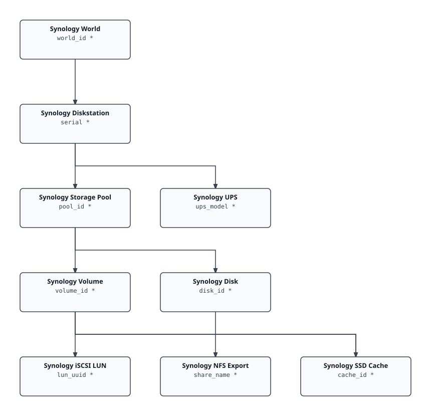

# VCF Content Factory Synology DiskStation — Documentation

> Generated index. The SVG diagram and per-kind table are regenerated on every
> build; prose sections (overview, installing) are hand-curated.

## Contents

| Section | Description |
|---------|-------------|
| [Overview](overview.md) | What's in the pack, resource kinds, cross-adapter notes |
| [Installing & Configuring](installing.md) | Prerequisites, configuration fields, step-by-step guide |
| [Inventory Tree](inventory-tree.md) | Traversal spec, per-kind table with identifying keys |
| [Metrics Reference](../REFERENCE.md) | Full metrics and properties reference (generated) |

## Inventory Tree

## Cross-MP Relationships

These edges are created at collection time via the Suite API and never appear in `describe.xml` — they are declared explicitly in `adapter.yaml` (`cross_mp_edges`) so this generated docset doesn't silently omit them. *Italic* endpoints belong to a foreign management pack; `code` endpoints are owned by this adapter.

| Parent | Child | Description |
|--------|-------|-------------|
| *VMWARE Datastore* (foreign, VMWARE) | `SynologyIscsiLun` | iSCSI LUN attached under the backing VMWARE Datastore (matched by computed VMFS extent NAA path); additive parentForeign edge via Suite API, resolved against real inventory only (no phantom Datastore minted when no match exists). One path can back N datastores (one per vCenter view) — bound to every copy. |
| *VMWARE Datastore* (foreign, VMWARE) | `SynologyNfsExport` | NFS export attached under the backing VMWARE Datastore (matched by computed <nas_ip>/<vol_path>/<share> path per connected NAS interface); additive parentForeign edge via Suite API, deduped so a single Datastore never gets the same export as a duplicate child. |

## Quick Reference

- **Adapter kind:** `synology_diskstation`
- **Version:** 1.0.0.27
- **Traversal spec:** Synology DiskStation Storage Tree
- **Resource kinds:** 9
- **Cross-MP relationships:** 2 (see [Cross-MP Relationships](#cross-mp-relationships) below)
